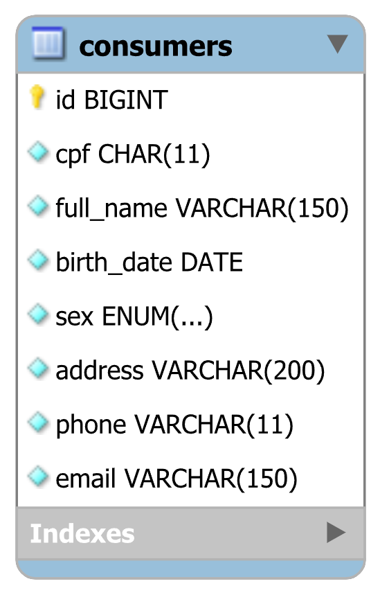

<div align="center">

# 🛒 Consumer API — Gestão de clientees


API REST para gerenciamento de clientees, desenvolvida como parte de um sistema distribuído de agendamentos. Expõe endpoints de CRUD completo para ser consumida pelas demais APIs do projeto.

</div>

---

## 📋 Índice

- [Visão Geral](#-visão-geral)
- [Deploy](#-deploy)
- [Tecnologias Utilizadas](#-tecnologias-utilizadas)
- [Modelagem de Dados](#-modelagem-de-dados)
- [Estrutura do Projeto](#-estrutura-do-projeto)
- [Instalação e Configuração](#️-instalação-e-configuração)
- [Como Executar](#-como-executar)
- [API REST — Endpoints](#-api-rest--endpoints)
- [DTOs](#-dtos)
- [Testes](#-testes)
- [Tratamento de Exceções](#️-tratamento-de-exceções)

---

## 🌐 Visão Geral

A **Consumer API** é uma API REST desenvolvida em Spring Boot responsável pelo gerenciamento de clientees dentro de um sistema distribuído de agendamentos de serviços. O sistema foi dividido entre três grupos, onde cada API é responsável por um domínio:

- **Grupo 1 (este projeto):** Consumer API — gerenciamento de clientees
- **Grupo 2:** Serviços API
- **Grupo 3:** Agendamentos API — consome esta API e a de Serviços

A solução oferece:

- Cadastro, consulta, atualização e remoção de **clientees** com validações de CPF e e-mail únicos
- **Validações automáticas** de formato de CPF, e-mail, telefone e data de nascimento
- **Documentação interativa** via Swagger UI para consumo pelos demais grupos
- **Tratamento padronizado de erros** com respostas estruturadas em JSON

---

## 🚀 Deploy

A API está disponível em produção via [Render](https://render.com):

| Recurso | URL |
|---|---|
| 📡 Base URL | https://consumer-api-vuxo.onrender.com |
| 📖 Swagger UI | https://consumer-api-vuxo.onrender.com/swagger-ui/index.html |
| 📄 OpenAPI JSON | https://consumer-api-vuxo.onrender.com/v3/api-docs |

> ⚠️ O serviço utiliza o plano gratuito do Render. Após período de inatividade, a primeira requisição pode levar até **50 segundos** para responder enquanto o servidor inicializa.

---

## 🛠 Tecnologias Utilizadas

| Tecnologia | Versão | Justificativa |
|---|---|---|
| Java | 21 | Versão LTS mais recente, com melhorias de performance e novos recursos de linguagem. |
| Spring Boot | 3.5.13 | Framework robusto para criação de APIs REST em Java, reduzindo configuração e acelerando o desenvolvimento. |
| Spring Data JPA | gerenciado pelo Boot | Abstração sobre Hibernate/JPA que elimina código boilerplate de acesso a dados. |
| Spring Validation | gerenciado pelo Boot | Integração com Bean Validation para validação declarativa nos DTOs de entrada. |
| H2 Database | gerenciado pelo Boot | Banco em memória utilizado na aplicação e nos testes, sem necessidade de instalação externa. |
| Lombok | gerenciado pelo Boot | Reduz código repetitivo como getters, setters e construtores, mantendo as entidades limpas. |
| SpringDoc OpenAPI | 2.8.6 | Gera automaticamente a documentação Swagger UI a partir das anotações do código. |
| JUnit 5 | 5.11.4 | Framework padrão da indústria para testes unitários em Java. |
| Mockito | 5.14.2 | Framework de mocking para isolar dependências nos testes unitários. |
| Maven | 3.9.14 | Gerenciador de dependências e build do projeto. |

---

## 🗄 Modelagem de Dados

### Diagrama Entidade-Relacionamento



---

### Entidade Consumer

| Atributo | Tipo | Descrição |
|---|---|---|
| id (PK) | BIGINT | Identificador único, gerado automaticamente |
| cpf | VARCHAR(11) | CPF do cliente, único no sistema |
| fullName | VARCHAR(150) | Nome completo do cliente |
| birthDate | DATE | Data de nascimento |
| sex | VARCHAR(12) | Sexo (enum: MASCULINO, FEMININO, NAO_INFORMADO) |
| address | VARCHAR(200) | Endereço completo |
| phone | VARCHAR(11) | Telefone de contato (10 ou 11 dígitos) |
| email | VARCHAR(150) | E-mail do cliente, único no sistema |

### Script SQL

```sql
CREATE TABLE consumers (
    id         BIGINT       NOT NULL AUTO_INCREMENT,
    cpf        CHAR(11)     NOT NULL,
    full_name  VARCHAR(150) NOT NULL,
    birth_date DATE         NOT NULL,
    sex        ENUM('MASCULINO', 'FEMININO', 'NAO_INFORMADO') NOT NULL,
    address    VARCHAR(200) NOT NULL,
    phone      VARCHAR(11)     NOT NULL,
    email      VARCHAR(150) NOT NULL,
    PRIMARY KEY (id),
    UNIQUE KEY uk_consumers_cpf (cpf),
    UNIQUE KEY uk_consumers_email (email)
);
```

---

## 📁 Estrutura do Projeto

```
src/
├── main/
│   ├── java/io/github/consumerapi/
│   │   ├── config/
│   │   │   └── OpenApiConfig.java
│   │   ├── controller/
│   │   │   └── ConsumerController.java
│   │   ├── domain/
│   │   │   └── Consumer.java
│   │   ├── dto/
│   │   │   ├── ConsumerRequestDTO.java
│   │   │   └── ConsumerResponseDTO.java
│   │   ├── enums/
│   │   │   └── Sex.java
│   │   ├── exception/
│   │   │   ├── DuplicateResourceException.java
│   │   │   ├── ErrorResponse.java
│   │   │   ├── GlobalExceptionHandler.java
│   │   │   └── ResourceNotFoundException.java
│   │   ├── mapper/
│   │   │   └── ConsumerMapper.java
│   │   ├── repository/
│   │   │   └── ConsumerRepository.java
│   │   ├── service/
│   │   │   └── ConsumerService.java
│   │   └── ConsumerApiApplication.java
│   └── resources/
│       └── application.properties
└── test/
    ├── java/io/github/consumerapi/
    │   ├── controller/
    │   │   └── ConsumerControllerIntegrationTest.java
    │   └── service/
    │       └── ConsumerServiceTest.java
    └── resources/
        └── application-test.properties

```

### Propósito de Cada Camada

**`controller/`** — Camada de entrada da API. Recebe as requisições HTTP, valida os dados de entrada com `@Valid` e delega o processamento ao Service. Nunca contém regra de negócio e nunca retorna entidades JPA — apenas DTOs.

**`domain/`** — Entidade JPA que representa a tabela do banco de dados. A entidade nunca sai desta camada para a API — esse isolamento protege a estrutura interna do banco e permite evoluir o modelo sem quebrar contratos da API.

**`dto/`** — Objetos de transferência de dados que trafegam entre o Controller e o cliente. Desacoplam a API da estrutura interna do banco. O DTO de Request carrega as anotações de validação (`@NotNull`, `@Size`, etc.). O DTO de Response expõe apenas os campos necessários.

**`enums/`** — Agrupa os valores possíveis para o campo sexo do cliente.

**`exception/`** — Exceções customizadas, o `ErrorResponse` e um `GlobalExceptionHandler` com `@RestControllerAdvice` que intercepta todos os erros e retorna respostas padronizadas com mensagens claras para o cliente da API.

**`mapper/`** — Converte a entidade JPA em DTOs e vice-versa. Centraliza a lógica de mapeamento, evitando duplicação no Service.

**`repository/`** — Interface que estende `JpaRepository`, fornecendo operações CRUD automáticas. Contém consultas personalizadas como `findByCpf`, `findByFullNameContainingIgnoreCase`, `existsByCpf` e `existsByEmail`.

**`service/`** — Implementa todas as regras de negócio e validações. A separação nesta camada garante que a lógica não fique espalhada pelo código e facilita os testes unitários com Mockito.

---

## ⚙️ Instalação e Configuração

### Pré-requisitos

| Ferramenta | Versão | Link |
|---|---|---|
| Java (JDK) | 21+ | https://adoptium.net/ |
| Maven | 3.9.14+ | https://maven.apache.org/ |
| Git | qualquer | https://git-scm.com/ |

> Não é necessário instalar banco de dados — a aplicação utiliza H2 em memória.

### 1. Clone o repositório

```bash
git clone https://github.com/Staloch-Dev/consumer-api.git
cd consumer-api
```

### 2. Instale as dependências

```bash
mvn clean install
```

---

## ▶ Como Executar

```bash
mvn spring-boot:run
```

Após subir a aplicação, os seguintes recursos estarão disponíveis:

| Recurso | URL |
|---|---|
| 📖 Swagger UI | http://localhost:8080/swagger-ui/index.html |
| 📄 OpenAPI JSON | http://localhost:8080/v3/api-docs |
| 🗄 H2 Console | http://localhost:8080/h2-console |

---

## 📡 API REST — Endpoints

Base URL: `http://localhost:8080`

A documentação interativa completa, com possibilidade de testar todos os endpoints diretamente no navegador, está disponível em: **http://localhost:8080/swagger-ui/index.html**


IMAGEM AQUI
---

### Consumers

| Método | Endpoint | Descrição | Resposta |
|---|---|---|---|
| `POST` | `/consumers` | Cadastrar novo cliente | `201 Created` |
| `GET` | `/consumers` | Listar todos ou filtrar por nome | `200 OK` |
| `GET` | `/consumers/{id}` | Buscar cliente por ID | `200 OK` |
| `GET` | `/consumers/cpf/{cpf}` | Buscar cliente por CPF | `200 OK` |
| `PUT` | `/consumers/{id}` | Atualizar dados do cliente | `200 OK` |
| `DELETE` | `/consumers/{id}` | Excluir cliente | `204 No Content` |

---

#### POST `/consumers` — Cadastrar cliente

**Request Body:**
```json
{
  "cpf": "12345678901",
  "fullName": "Johnny Test",
  "birthDate": "1994-06-21",
  "sex": "MASCULINO",
  "address": "Rua Porkbelly, 11, São Paulo - SP",
  "phone": "1134567890",
  "email": "johnny@porkbelly.com"
}
```

**Response `201 Created`:**
```json
{
  "id": 1,
  "cpf": "12345678901",
  "fullName": "Johnny Test",
  "birthDate": "1994-06-21",
  "sex": "MASCULINO",
  "address": "Rua Porkbelly, 11, São Paulo - SP",
  "phone": "1134567890",
  "email": "johnny@porkbelly.com"
}
```

---

#### GET `/consumers` — Listar todos ou filtrar por nome

**Query param opcional:** `?name=Johnny`

**Response `200 OK`:**
```json
[
  {
    "id": 1,
    "cpf": "12345678901",
    "fullName": "Johnny Test",
    "birthDate": "1994-06-21",
    "sex": "MASCULINO",
    "address": "Rua Porkbelly, 11, São Paulo - SP",
    "phone": "1134567890",
    "email": "johnny@porkbelly.com"
  }
]
```

---

#### GET `/consumers/{id}` — Buscar cliente por ID

**Response `200 OK`:**
```json
{
  "id": 1,
  "cpf": "12345678901",
  "fullName": "Johnny Test",
  "birthDate": "1994-06-21",
  "sex": "MASCULINO",
  "address": "Rua Porkbelly, 11, São Paulo - SP",
  "phone": "1134567890",
  "email": "johnny@porkbelly.com"
}
```

---

#### GET `/consumers/cpf/{cpf}` — Buscar cliente por CPF

**Response `200 OK`:**
```json
{
  "id": 1,
  "cpf": "12345678901",
  "fullName": "Johnny Test",
  "birthDate": "1994-06-21",
  "sex": "MASCULINO",
  "address": "Rua Porkbelly, 11, São Paulo - SP",
  "phone": "1134567890",
  "email": "johnny@porkbelly.com"
}
```

---

#### PUT `/consumers/{id}` — Atualizar cliente

**Request Body:**
```json
{
  "cpf": "12345678901",
  "fullName": "Johnny Test Atualizado",
  "birthDate": "1994-06-21",
  "sex": "MASCULINO",
  "address": "Praia de Ipanema, 462, Rio de Janeiro - RJ",
  "phone": "2199998888",
  "email": "johnny.novo@porkbelly.com"
}
```

**Response `200 OK`:**
```json
{
  "id": 1,
  "cpf": "12345678901",
  "fullName": "Johnny Test Atualizado",
  "birthDate": "1994-06-21",
  "sex": "MASCULINO",
  "address": "Praia de Ipanema, 462, Rio de Janeiro - RJ",
  "phone": "2199998888",
  "email": "johnny.novo@porkbelly.com"
}
```

---

#### DELETE `/consumers/{id}` — Excluir cliente

**Response `204 No Content`** — sem body.

---

## 📦 DTOs

### ConsumerRequestDTO — Entrada

| Campo | Tipo | Validações | Descrição |
|---|---|---|---|
| cpf | String | `@NotBlank`, `@Pattern(\d{11})` | CPF sem formatação, exatamente 11 dígitos |
| fullName | String | `@NotBlank`, `@Size(max=150)` | Nome completo |
| birthDate | LocalDate | `@NotNull`, `@Past` | Data de nascimento, deve ser no passado |
| sex | Sex | `@NotNull` | Enum: MALE, FEMALE, NOT_INFORMED |
| address | String | `@NotBlank`, `@Size(max=200)` | Endereço completo |
| phone | String | `@NotBlank`, `@Pattern(\d{10,11})` | Telefone com 10 ou 11 dígitos |
| email | String | `@NotBlank`, `@Email`, `@Size(max=150)` | E-mail válido e obrigatório |

### ConsumerResponseDTO — Saída

Retorna todos os campos do `ConsumerRequestDTO` acrescidos do `id` gerado pelo banco.

---

## 🧪 Testes

O projeto possui cobertura de testes **unitários** com JUnit 5 + Mockito e testes de **integração** com `@SpringBootTest` + banco H2 em memória.

### Executar todos os testes

```bash
mvn test
```

### Cobertura de Testes

| Classe de Teste | Tipo | Cenários Cobertos |
|---|---|---|
| `ConsumerServiceTest` | Unitário (JUnit 5 + Mockito) | Create, FindById, FindByCpf, FindByName, FindAll, Update, Delete — sucesso e falha |
| `ConsumerControllerIntegrationTest` | Integração (H2 + MockMvc) | Todos os endpoints — status HTTP e retorno JSON |

### 🧪 Cenários de Teste

O projeto utiliza **JUnit 5**, **Mockito** e **AssertJ** para garantir a qualidade do código através de testes unitários e de integração.

#### **Camada de Service (Testes Unitários)**
*Focados na lógica de negócio e isolamento de dependências via Mockito.*

| Método | Tipo | Descrição |
|---|---|---|
| `shouldCreateConsumerAndReturnResponseDTOSuccessfully` | Sucesso | Cria cliente e retorna DTO com sucesso |
| `shouldThrowDuplicateResourceExceptionWhenCpfAlreadyExists` | Falha | Erro ao cadastrar CPF já existente |
| `shouldThrowDuplicateResourceExceptionWhenEmailAlreadyExists` | Falha | Erro ao cadastrar e-mail já existente |
| `shouldReturnResponseDTOWhenConsumerExists` | Sucesso | Busca cliente por ID com sucesso |
| `shouldThrowResourceNotFoundExceptionWhenConsumerNotExists` | Falha | Erro ao buscar ID inexistente |
| `shouldReturnResponseDTOWhenCpfExists` | Sucesso | Busca cliente por CPF com sucesso |
| `shouldThrowResourceNotFoundExceptionWhenCpfNotExists` | Falha | Erro ao buscar CPF inexistente |
| `shouldReturnConsumersWhenNameMatches` | Sucesso | Busca clientes por parte do nome (Ignore Case) |
| `shouldReturnEmptyListWhenNoConsumerMatchesName` | Sucesso | Retorna lista vazia se nome não for encontrado |
| `shouldReturnListOfResponseDTOsWhenConsumersExist` | Sucesso | Lista todos os clientes cadastrados |
| `shouldReturnEmptyListWhenNoConsumersExist` | Sucesso | Retorna lista vazia se não houver cadastros |
| `shouldUpdateConsumerAndReturnResponseDTOSuccessfully` | Sucesso | Atualiza dados do cliente com sucesso |
| `shouldThrowDuplicateResourceExceptionWhenUpdatingWithExistingCpf` | Falha | Erro ao atualizar usando CPF de outro cliente |
| `shouldThrowDuplicateResourceExceptionWhenUpdatingWithExistingEmail` | Falha | Erro ao atualizar usando e-mail de outro cliente |
| `shouldThrowResourceNotFoundExceptionWhenUpdatingNonExistentConsumer` | Falha | Erro ao tentar atualizar cliente inexistente |
| `shouldDeleteConsumerSuccessfully` | Sucesso | Remove cliente por ID com sucesso |
| `shouldThrowResourceNotFoundExceptionWhenDeletingNonExistentConsumer` | Falha | Erro ao tentar deletar cliente inexistente |

#### **Camada de Controller (Testes de Integração)**
*Focados em rotas HTTP, payloads JSON e Bean Validation utilizando banco H2 e MockMvc.*

| Método | Status HTTP | Descrição |
|---|:---:|---|
| `shouldCreateConsumerAndReturn201` | `201` | Valida criação via POST e persistência no banco |
| `shouldReturn409WhenCpfAlreadyExists` | `409` | Valida conflito de CPF duplicado via endpoint |
| `shouldReturn409WhenEmailAlreadyExists` | `409` | Valida conflito de e-mail duplicado via endpoint |
| `shouldReturn400WhenCpfIsInvalid` | `400` | **Valida anotação @CPF no ConsumerRequestDTO** |
| `shouldReturn400WhenEmailIsInvalid` | `400` | **Valida anotação @Email no ConsumerRequestDTO** |
| `shouldReturn200WhenConsumerExistsById` | `200` | Valida busca por ID via GET |
| `shouldReturn404WhenConsumerNotFoundById` | `404` | Valida resposta para busca de ID inexistente |
| `shouldReturn200WhenConsumerExistsByCpf` | `200` | Valida busca por CPF via GET |
| `shouldReturn404WhenConsumerNotFoundByCpf` | `404` | Valida resposta para busca de CPF inexistente |
| `shouldReturn200WithListOfConsumers` | `200` | Valida retorno da lista completa de clientes |
| `shouldReturn200WithEmptyList` | `200` | Valida retorno de lista vazia (sem erro) |
| `shouldReturn200FilteringByName` | `200` | Valida busca filtrada por parâmetro 'name' |
| `shouldUpdateConsumerAndReturn200` | `200` | Valida atualização de dados via PUT |
| `shouldAllowUpdateKeepingOwnCpfAndEmail` | `200` | Valida atualização sem conflito com os próprios dados |
| `shouldReturn409WhenUpdatingWithExistingCpf` | `409` | Valida conflito de CPF de terceiros no Update |
| `shouldReturn409WhenUpdatingWithExistingEmail` | `409` | Valida conflito de e-mail de terceiros no Update |
| `shouldDeleteConsumerAndReturn204` | `204` | Valida exclusão de recurso via DELETE |

---

## 📐 Regras de Negócio

| Código | Regra |
|---|---|
| RN01 | O CPF do cliente deve ser **único** no sistema. Tentativa de cadastro com CPF já existente lança `DuplicateResourceException`. |
| RN02 | O e-mail do cliente deve ser **único** no sistema. Tentativa de cadastro com e-mail já existente lança `DuplicateResourceException`. |
| RN03 | Ao **atualizar**, se o CPF informado for diferente do atual e já pertencer a outro cliente, lança `DuplicateResourceException`. |
| RN04 | Ao **atualizar**, se o e-mail informado for diferente do atual e já pertencer a outro cliente, lança `DuplicateResourceException`. |

---

## ⚠️ Tratamento de Exceções

Todos os erros são tratados pelo `GlobalExceptionHandler` (`@RestControllerAdvice`) e retornam respostas padronizadas:

```json
{
  "timestamp": "2024-01-15T08:30:00",
  "status": 404,
  "error": "Not Found",
  "message": "Cliente com ID 99 não encontrado.",
  "path": "/consumers/99"
}
```

### Códigos de Resposta HTTP

| Código | Situação |
|---|---|
| `200 OK` | Consulta ou atualização realizadas com sucesso |
| `201 Created` | Recurso criado com sucesso |
| `204 No Content` | Recurso removido com sucesso |
| `400 Bad Request` | Dados inválidos (Bean Validation) |
| `404 Not Found` | Cliente não encontrado |
| `409 Conflict` | CPF ou e-mail já cadastrado |
| `500 Internal Server Error` | Erro interno não tratado |

### Exceções Customizadas

| Exceção | Situação | HTTP |
|---|---|---|
| `ResourceNotFoundException` | Cliente não encontrado por ID ou CPF | `404` |
| `DuplicateResourceException` | CPF ou e-mail já cadastrado no sistema | `409` |

---

<div align="center">

Feito com ☕ e Spring Boot

</div>
